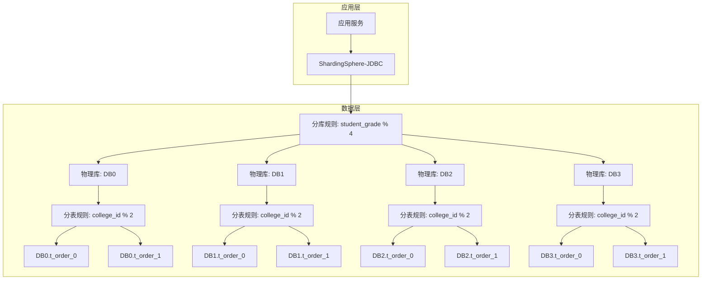
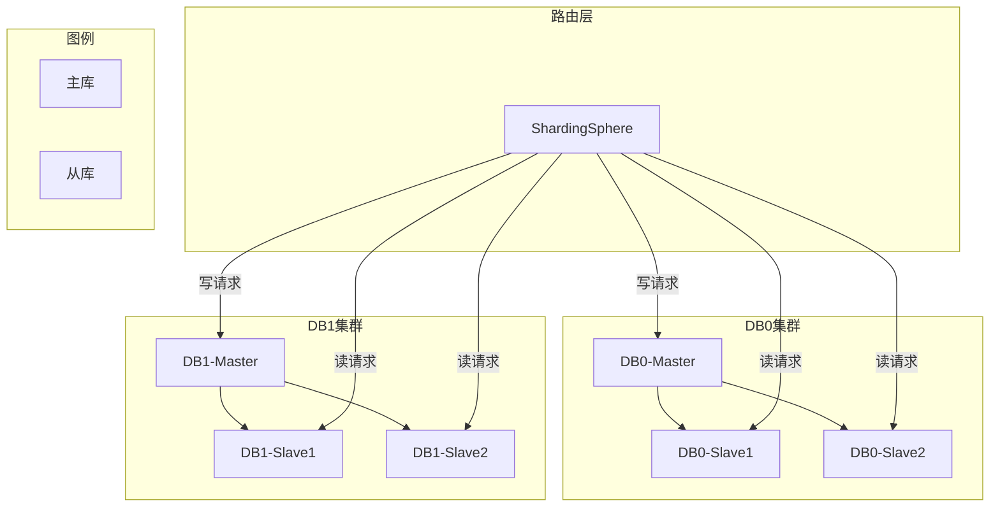
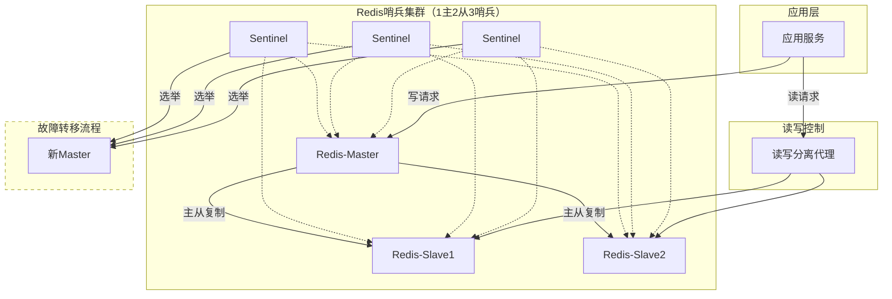
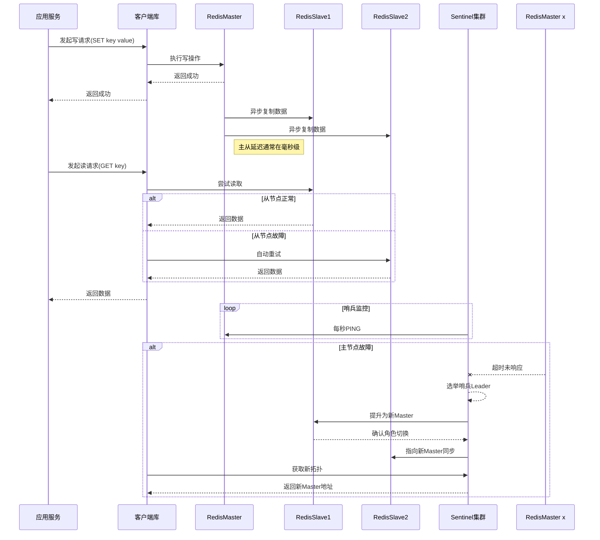
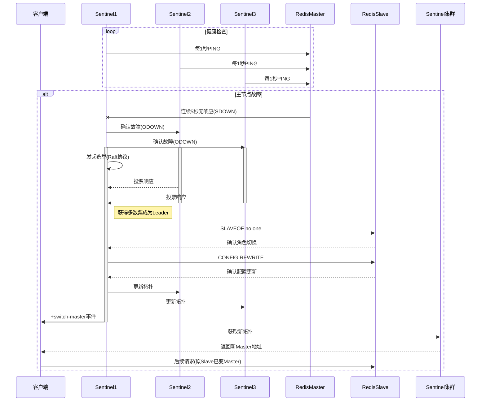
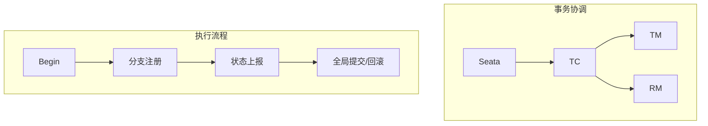
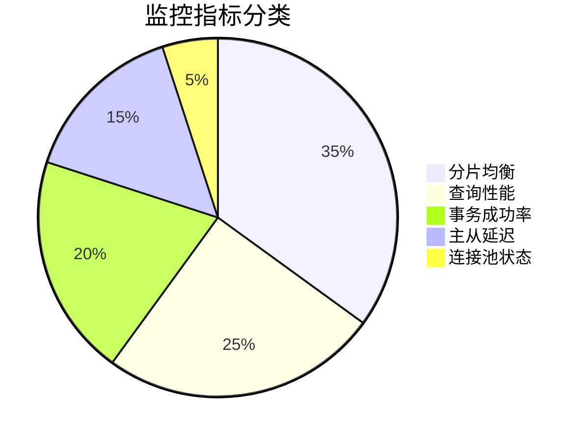

# 敦行智能教学助手

## 1.项目目标

## 2.项目功能

## 3.项目技术栈

### 3.1 服务端技术栈

本项目为微服务项目，分别为网关、认证服务、教学大纲服务...

总体框架采用 JDK17 + SpringBoot3.2 + SpringCloud2023 + SpringCloudAlibaba2022

数据库相关技术 MySQL8.0 + Redis6.2 + MongoDB2.5 + ElasticSearch7.17.9

数据库持久层技术 MyBites + MyBites-Plus + ShardingSphere-JDBC

消息队列 RabbitMQ + kafka

注册中心 nacos

远程调用 Feign

日志收集 ELK Stack(Elasticsearch,Logstash,Kibana)

其他 SpringAI + Seata

技术架构图

#### 3.1.1数据库总体架构设计

##### 3.1.1.1 数据库分库分表架构设计

##### 3.1.1.2 数据库读写分离集群架构设计

##### 3.1.1.3 数据库缓存设计

缓存架构：

读写流程说明：

故障转移说明：

##### 3.1.1.4 分布式事务方案设计

##### 3.1.1.5 数据库监控指标设计

##### 3.1.1.6 数据库表设计

#### 3.1.2日志收集流程

